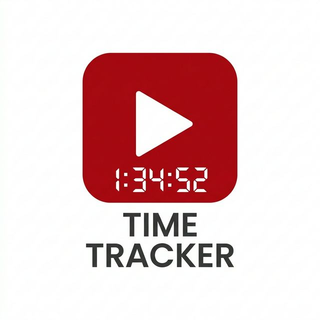

# YouTube Time Tracker

A professional Chrome extension designed to help you take control of your YouTube viewing habits. It monitors your watch time, blocks distractions, and encourages productive breaks.



## 🚀 Key Features

### 1. Advanced Shorts Blocker
- **Feed Hiding**: Automatically removes Shorts from your Home feed, Subscription feed, and Sidebar.
- **Search Filtering**: Filters out Shorts from search results.
- **Mocking Screen**: If you navigate directly to a `/shorts/` URL, the extension intercepts it with a custom "SHORTS BLOCKED" overlay to prevent mindless scrolling.
- **Reordered Sidebar**: Moves "Subscriptions" and "You" to the top, pushing legacy distractions lower.

### 2. Stats & Analytics Dashboard
- **Live Tracking**: Records precise watch time for every video you view.
- **7-Day Trends**: A beautiful bar chart visualizing your YouTube usage over the past week.
- **Weekly Distribution**: A conic-gradient pie chart showing which days you spent the most time on.
- **Key Insights**: Automatically calculates your highest activity day and average daily usage.

### 3. Smart Watch History
- **Progress Tracking**: See exactly how much of each video you've watched.
- **Interactive List**: Click any history item to jump back to where you left off.
- **Manual Management**: Remove specific videos from your tracked history with a single click.

### 4. Intelligent Break Reminder
- **Motivational Quotes**: Periodically fetches inspiring quotes from the ZenQuotes API.
- **Auto-Pause**: Automatically pauses video playback and overlays a motivational prompt after a set interval.
- **Quick Actions**: "Go to Work" (redirects to a custom URL) or "Keep Watching" (resets the timer).

### 5. Premium UI/UX
- **Draggable Toggle**: Move the stats button anywhere on your screen.
- **Resizable Sidebar**: Pull the sidebar to your desired width (300px to 800px).
- **Glassmorphism Design**: Modern, semi-transparent interface that adapts to YouTube's Light and Dark modes.

---

## 🛠 Technical Architecture

The project follows a **Domain-Driven Design (DDD)** folder structure to ensure maintainability and scalability.

- **`src/shared/`**: Centralized state management, constants, and theme variables.
- **`src/shorts-blocker/`**: Elements for CSS injection and URL navigation blocking.
- **`src/stats-tracker/`**: Component-based UI logic for the sidebar, charts, and tracking engine.
- **`src/break-reminder/`**: Logic for interval checking and background quote fetching.
- **`src/settings/`**: Modular settings UI components.
- **`src/init/`**: Bootstrapping, MutationObservers, and responsive design overrides.

### Build System
Since Chrome extensions (MV3) do not natively support ES modules in content scripts without a bundler, this project uses a lightweight **`build.js`** script.
- It concatenates 13 modular JS files into one optimized `dist/content.js`.
- It performs line-count verification to ensure every source file stays under the **300-line maintainability limit**.

---

## 📦 Installation (Development)

1. Clone this repository or download the source code.
2. Ensure you have [Node.js](https://nodejs.org/) installed.
3. Run the build script to generate the distribution files:
   ```bash
   node build.js
   ```
4. Open Chrome and navigate to `chrome://extensions`.
5. Enable **Developer mode** (top right).
6. Click **Load unpacked** and select the root directory of this project.

---

## ⚙️ Customization

Open the Sidebar and click the **Settings** icon to:
- Enable/Disable the **Shorts Blocker**.
- Toggle the **Break Reminder**.
- Adjust the **Reminder Interval** (5 to 120 minutes).
- Set your custom **Work/Home URL** (where the "Go to Work" button takes you).

---

## 🔒 Privacy

- **Local Storage**: All your watch history and settings are stored locally on your machine using `localStorage`. 
- **No Tracking**: No data is sent to external servers, except for an anonymous request to `zenquotes.io` to fetch motivational quotes (if the Break Reminder is enabled).
